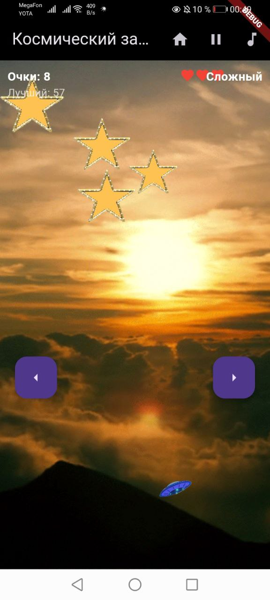

# Космический Защитник: Руководство по игре

## Что, зачем?

Здесь вы — капитан космического корабля **Atlanta**, смелый исследователь глубин Вселенной. Ваша миссия — защитить свой корабль от опасных астероидов и звезд, которые несутся прямо на вас. Но это не просто борьба за выживание — это испытание ваших рефлексов, стратегии и упорства. Сможете ли вы стать легендой среди капитанов или будете поглощены бескрайним космосом? Все зависит от вас.

---

## Описание приложения

**Космический Защитник** — это динамичная игра, где вам предстоит уклоняться от падающих объектов (астероидов или звезд) и набирать очки. Игра сочетает в себе яркие визуальные эффекты, захватывающие звуки и множество опций для персонализации игрового процесса. Вот основные особенности:

---

### Особенности игры

#### 1. **Анимации**
Игра наполнена плавными анимациями, которые делают игровой процесс более живым и захватывающим. Движение астероидов, взрывы корабля и другие эффекты создают атмосферу настоящего космического приключения.

#### 2. **Трекинг лучших очков/времени**
- Ваш прогресс сохраняется: игра отслеживает ваш **лучший счет** и **время выживания**.
- После каждой игры вы можете сравнить свои результаты с предыдущими рекордами и стремиться побить их.

#### 3. **Опционально проиграть или выиграть**
- В режиме "Астероиды" и "Звезды" вы можете как **проиграть**, столкнувшись с объектом, так и **выиграть**, успешно завершив уровень.
- Это добавляет гибкость в игровой процесс: хотите ли вы испытать свои навыки до конца или просто насладиться атмосферой?

#### 4. **Картинки и звуки**
- Игра использует красивые изображения для фона (`about.png`, `im.png`) и интерфейса, которые погружают вас в космическую атмосферу.
- Звуковые эффекты, такие как треки победы (`win.mp3`) и поражения (`lose.mp3`), усиливают эмоции и делают игру более увлекательной.

#### 5. **Разный уровень сложности**
- Выберите подходящий уровень сложности:
  - **Легкий**: идеально для новичков.
  - **Сложный**: для опытных игроков.
  - **Бесконечный**: проверьте свои навыки в бесконечном режиме.

#### 6. **Несколько уровней**
- Игра предлагает два уникальных режима:
  - **Режим Астероиды**: уклоняйтесь от летящих астероидов.
  - **Режим Звезды**: избегайте падающих звезд, которые движутся быстрее и сложнее предсказать.

---

## Скриншоты

  
  
  
  
  
  

---

## Как играть

1. **Главное меню**:
   - Выберите режим игры ("Астероиды" или "Звезды").
   - Настройте уровень сложности.
   - Наслаждайтесь фоновой музыкой или отключите её с помощью специальной кнопки.

2. **Игровой процесс**:
   - Управляйте кораблем с помощью сенсорного управления или клавиш.
   - Уклоняйтесь от падающих объектов и набирайте очки.
   - Постарайтесь выжить как можно дольше!

3. **Экран результатов**:
   - После завершения игры вы увидите свой текущий счет и лучший счет.
   - Вернитесь в главное меню, чтобы попробовать снова.

---

## Технические детали

- **Flutter**: Игра разработана на фреймворке Flutter, что обеспечивает высокую производительность и кроссплатформенность.
- **Пакеты**:
  - `audioplayers`: для воспроизведения звуков.
  - `flutter_launcher_icons`: для настройки иконки приложения.

---

## Лицензия
Этот проект распространяется под лицензией MIT. Подробности см. в файле LICENSE .

## Разработчики

- **intbizarre** — автор и разработчик, студент на грани вылета, любитель ходить в кино с друзьями.
- **Contact**: st107267@mail.spbu.ru

---

### Лицензия

Этот проект лицензирован под [MIT License](LICENSE).

---

Если что-то из описанного выше не понятно или нужно больше информации, не стесняйтесь обращаться!
